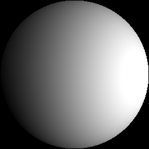
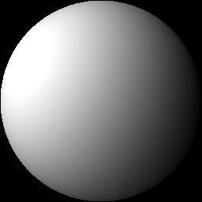
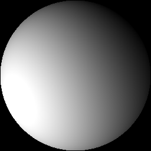
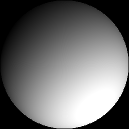

<!--<h3><b>DPR</b></h3>-->
## <b>Deep Single-Image Portrait Relighting</b> [[Project Page]](http://zhhoper.github.io/dpr.html) <br>
Hao Zhou, Sunil Hadap, Kalyan Sunkavalli, David W. Jacobs. In ICCV, 2019

<p>


</p>
<p>






</p>

### Overview
```bash
python3 inference.py
```

### Dependencies ###
<p> pytorch >= 1.0.0 </p>
<p> opencv >= 4.0.0 </p>
<P> shtools: https://shtools.oca.eu/shtools/ (optional)</p>

### Notes
We include an example image and seven example lightings in data. Note that different methods may have different coordinate system for Spherical Harmonics (SH), you may need to change the coordiante system if you use SH lighting from other sources. The coordinate system of our method is in accordance with shtools, we provide a function utils_normal.py in utils to help you tansfer the coordinate system from [bip2017](https://gravis.dmi.unibas.ch/PMM/data/bip/) and [sfsNet](https://senguptaumd.github.io/SfSNet/) to our coordinate system. To use utils_normal.py you need to install shtools. The code is for research purpose only.

### Data Preparation
We publish the code for data preparation, please find it in (https://github.com/zhhoper/RI_render_DPR).

### Citation
If you use this code for your research, please consider citing:
```
@InProceedings{DPR,
  title={Deep Single Portrait Image Relighting},
  author = {Hao Zhou and Sunil Hadap and Kalyan Sunkavalli and David W. Jacobs},
  booktitle={International Conference on Computer Vision (ICCV)},
  year={2019}
}
```
